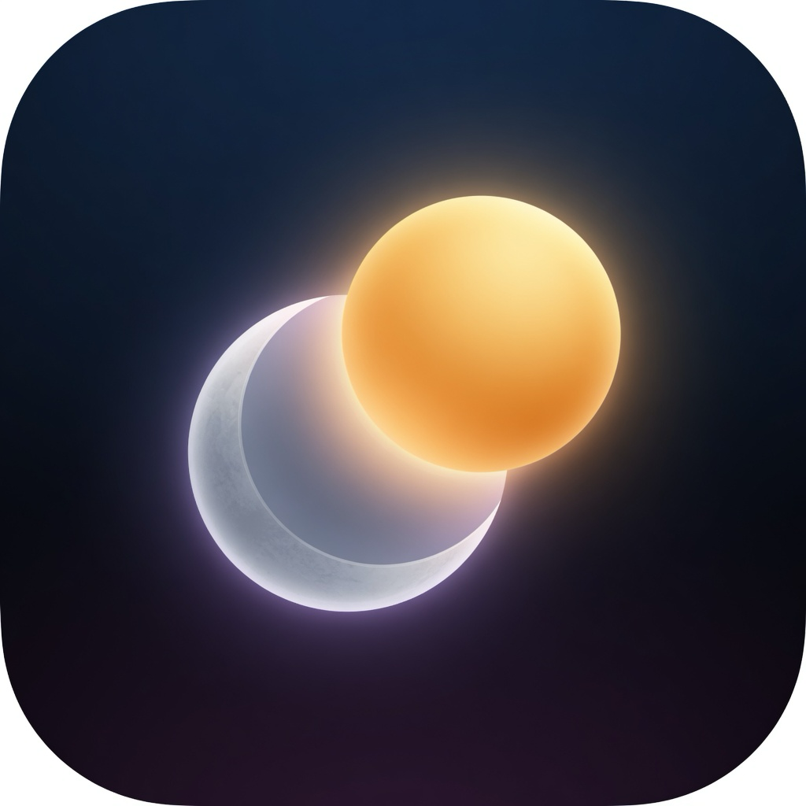

# Awake

<p align="center">
  
</p>

A native macOS menu-bar app by **Mario Codarin**. Daily stand-in for:

```sh
sudo pmset -a disablesleep 1   # disable sleep
sudo pmset -a disablesleep 0   # allow sleep again
```

One toggle. No password. No Dock icon. No leftover setting if you quit.

Requires macOS 13 or later on Apple Silicon.

## Download

Get the ready **macOS arm64** app from [Releases](https://github.com/MarioCodarin/Awake/releases/latest):

1. Download `Awake-1.0.0-macos-arm64.zip`
2. Unzip and drag `Awake.app` into `/Applications`
3. Open it. First launch: right-click the app → **Open** (ad-hoc signed, not notarized)

Intel Macs: build from source instead.

## Build from source

```sh
./scripts/build-app.sh
```

Drag `dist/Awake.app` into `/Applications` and open it. A moon appears in the menu bar.

If  → Sleep is gray while Awake says **Sleep allowed**, a leftover `pmset disablesleep` flag is still on. In the popover tap **Unlock Apple Sleep…** (password once), or:

```sh
sudo pmset -a disablesleep 0
```

## Usage

Click the moon. Toggle **Disable sleep**.

- **On** — idle sleep is blocked without sudo. The next launch restores this if you left it on.
- **Off** — sleep is allowed again. **Quit** also allows sleep until you reopen the app.
- **Duration** — Indefinite, 15 minutes, 30 minutes, 1 hour, or 2 hours.
- **Keep display on** — also stops the display from sleeping.
- **Launch at login** — reliable after the app lives in `/Applications`.

The menu-bar icon is a moon when sleep is allowed and a sun while sleep is disabled.

## How it works

Awake does **not** run `pmset` or ask for a password. It holds IOKit assertions in-process:

- `PreventUserIdleSystemSleep` named `Awake` — blocks idle sleep, including on battery
- `PreventSystemSleep` named `Awake` — extra, stronger on AC (`caffeinate -s`); macOS may ignore it on battery
- `PreventUserIdleDisplaySleep` named `Awake Display` — when **Keep display on** is checked

Confirm while it is on:

```sh
pmset -g assertions
```

You should see `PreventUserIdleSystemSleep named: "Awake"`. Quit the app and those lines are gone.

Lid close and  → Sleep can still sleep a portable. `pmset disablesleep` is a persistent root override; Awake is the no-sudo daily switch and does not survive quitting.

## Privacy

Awake never leaves this Mac. No network, no accounts, no analytics.

## Build and test

Requires Swift 5.9+ (Xcode Command Line Tools are sufficient).

```sh
swift run AwakeChecks
./scripts/build-app.sh
open dist/Awake.app
```

## Architecture

See [docs/ARCHITECTURE.md](docs/ARCHITECTURE.md).

## License

MIT. Copyright © 2026 [Mario Codarin](https://github.com/MarioCodarin).
